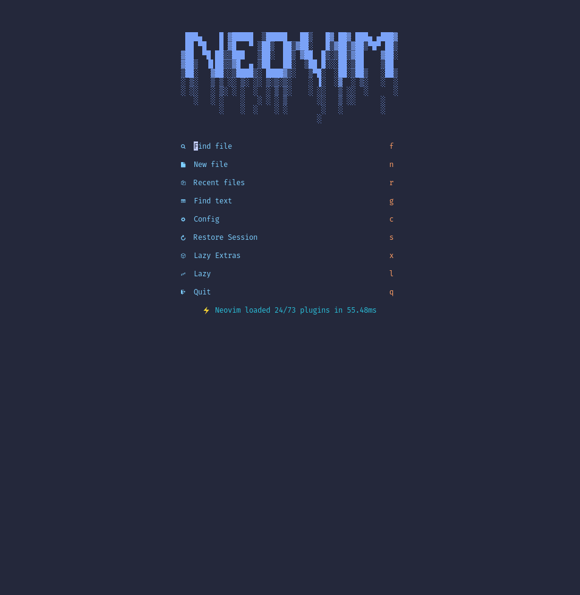
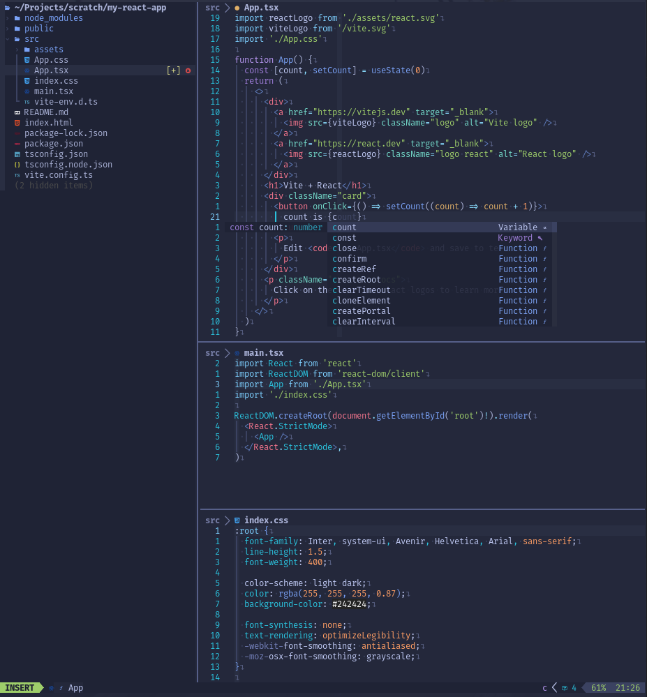
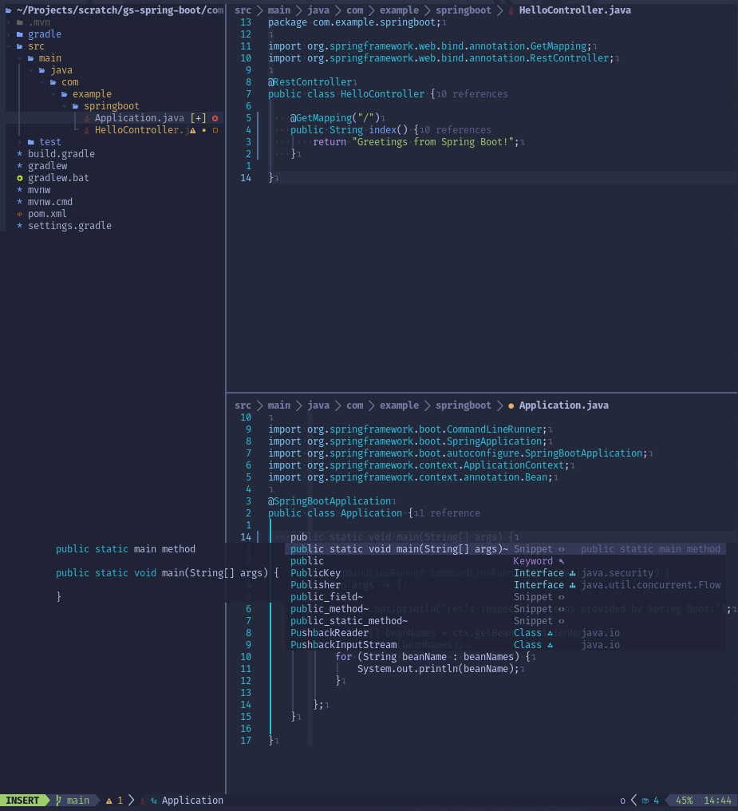
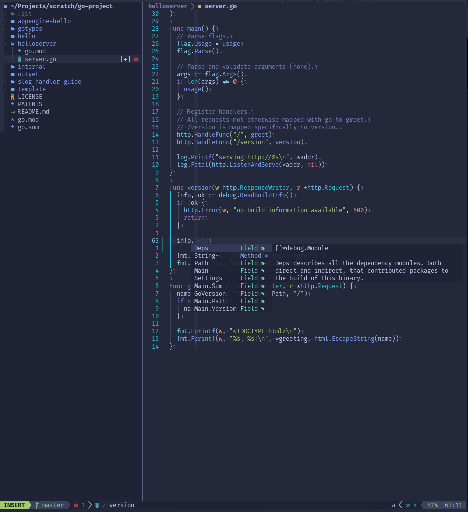

# My neovim config!

This is my personal neovim config for software development; mainly for javascript, typescript, go and java development.

Tested in Ubuntu, but it should work in other OSes. It shares the same requirements as [LazyVim](https://www.lazyvim.org/), and offers a similar feature-set (it's been customized to suit my needs).

Tested against neovim nightly.

### Start screen:

### Typescript/javascript projects:

### Maven/Gradle projects:

### Go projects:

